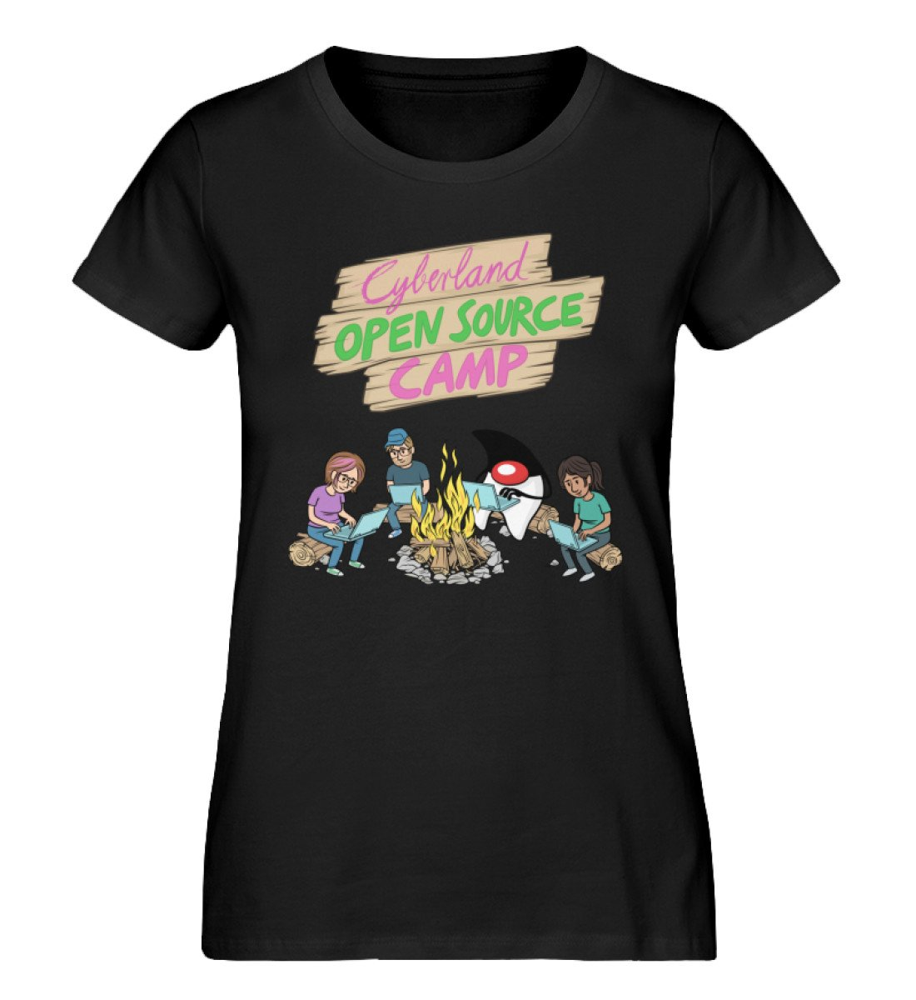
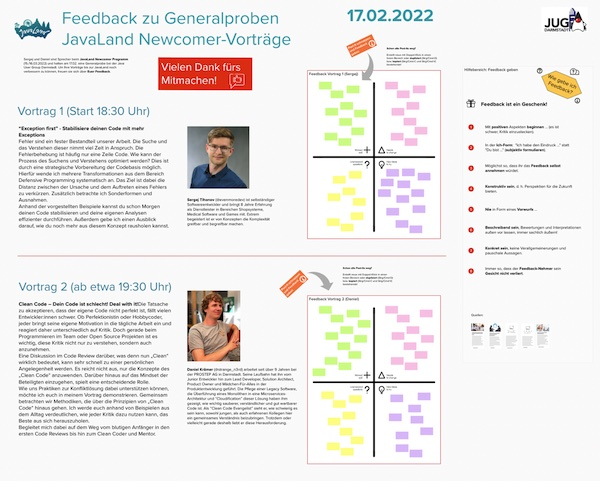

class: center, middle

# Aktuelle Informationen

.slideshow[<input id="autoSlideshow" type="checkbox" title="Auto Slideshow" /> Slideshow]
.copyright[[jug-da.de/slides](https://www.jug-da.de/slides) | &copy; 2022 [Java User Group Darmstadt](http://jug-da.de/)]

---
layout: true
.logo[]
.copyright[[jug-da.de/slides](https://www.jug-da.de/slides) | &copy; 2022 [Java User Group Darmstadt](http://jug-da.de/)]

---
background-color: #ff0000;

## <i class="fa fa-calendar"></i> Nächste Events

&nbsp;

  |  |  | 
------------- |------------- |------------- | -------------
**24.03.2022** | <i class="fa fa-globe"></i> | BDD - Brauchst Du Das? (**.darkblue[Katrin Rabow]**) | [<i class="fa fa-external-link"></i>](https://www.jug-da.de/2022/03/bdd/) |
**28.04.2022** | <i class="fa fa-globe"></i> | Open-Source – Mehr als nur Quellcode (**.darkblue[Christopher Dutz]**) | [<i class="fa fa-external-link"></i>](https://www.jug-da.de/) |
**19.05.2022** | <i class="fa fa-globe"></i> | GraphQL (**.darkblue[Nils Hartmann]**) | [<i class="fa fa-external-link"></i>](https://www.jug-da.de/2022/05/GraphQL/) |

.footnote[Veranstaltungsort: <i class="fa fa-globe"></i> Online / <i class="fa fa-university"></i> TU Darmstadt / <i class="fa fa-building"></i> Sponsor]

???

background-color: #ff0000;

## <i class="fa fa-calendar"></i> Nächste Events (2)

&nbsp;

  |  |  | 
------------- |------------- |------------- | -------------
**18.11.2021** | <i class="fa fa-globe"></i> | Eventually Consistency (**.darkblue[Susanne Braun]**) | [<i class="fa fa-external-link"></i>](https://www.jug-da.de/) |
**09.12.2021** | <i class="fa fa-globe"></i> | DDD mit jMolecules (**.darkblue[Oliver Drotbohm & Henning Schwentner]**) | [<i class="fa fa-external-link"></i>](https://www.jug-da.de/2021/06/Hibernate/) |

.footnote[Veranstaltungsort: <i class="fa fa-globe"></i> Online / <i class="fa fa-university"></i> TU Darmstadt / <i class="fa fa-building"></i> Sponsor]

---

background-image: url(img/jug-hilfe.jpg)

## <i class="fa fa-bullhorn"></i> Unterstützung

.stripe[<i class="fa fa-bullhorn" aria-hidden="true"></i> Weitersagen - [<i class="fa fa-print" aria-hidden="true"></i> Plakat aufhängen](http://jug-da.de/plakat)]  
.stripe[<i class="fa fa-globe" aria-hidden="true"></i> http://jug-da.de] 
.stripe[<i class="fa fa-twitter" aria-hidden="true"></i> [@JUG_DA](https://twitter.com/jug_da) - [<i class="fa fa-envelope-o" aria-hidden="true"></i>](https://groups.google.com/d/forum/jug-da) - [<i class="fa fa-rss-square" aria-hidden="true"></i>](https://www.jug-da.de/feed.xml) - [<i class="fa fa-calendar" aria-hidden="true"></i>](https://www.jug-da.de/events.ics)]

???

CC0 Creative Commons: https://pixabay.com/de/frau-posen-e-learning-weiblich-1401616/

Bitte ausdrucken und aufhängen: http://jug-da.de/plakat
Gern Bild twittern an @JUG_DA.

---

background-image: url(img/jug-welcome.jpg)

## <i class="fa fa-list-alt"></i> Sponsoring

.stripe[Gastgeber]  
.stripe[Catering]  
.stripe[Merchandising] 

???

CC0 Creative Commons: https://pixabay.com/de/frau-posen-e-learning-weiblich-1447068/

Wir suchen interessierte Firmen:
- Raumanforderung: .strong[30+]
- Zeitraum: abends ab .strong[18:30 Uhr]
- Lage: .strong[Darmstadt (Zentrumsnähe)]
- Kontakt: info@jug-da.de
- Übernahme von Catering
- Kaufen von Merchandise-Artikeln (T-Shirts, Tassen, ...)

---

## <i class="fa fa-bullhorn"></i> Weitere Veranstaltungen

.beam[ 9. März 2022 (kostenfrei)]
.beam[ 15. - 17. März 2022 (Rabatt für iJUG-Mitglieder)]
.beam[ 02. - 06. Mai 2022 (15 % Rabatt)]  

### Rabattcodes über orga@jug-da.de

---

background-image: url(img/jug-newcomer.jpg)

## <i class="fa fa-search"></i> Newcomer werden

- Vortrag auf einer (großen) Konferenz halten?

- Wir unterstützen Euch: 
  - Thema
  - Titel, Abstract
  - Einreichung
  - Folien
  - Generalprobe bei der JUG
  - Tipps und Tricks zum Vortragsstil

- <i class="fa fa-female"></i> + <i class="fa fa-male"></i>

- **Traut Euch. Meldet Euch. Sprecht uns an.**

???

CC0 Creative Commons: https://pixabay.com/de/frau-posen-e-learning-weiblich-1447092/

- zwei JUG Darmstadt Newcomer pro Jahr, mindestens eine Frau
- Primärziel nächste JavaLand, aber auch gern andere, lokale Konferenzen
- bei der JavaLand entweder klassisch über den normalen CfP oder über das Newcomer-Programm

???

## <i class="fa fa-bullhorn"></i> Coming soon: Kids4IT

- Tagesveranstaltung wie Devoxx4Kids, Kids4IT, CoderDojo, ...

- Darmstädter Kinder und Jugendliche als Teilnehmer

- Veranstaltungsort Darmstadt (Sponsoren und Räumlichkeiten gesucht)

- ggf. Zusammenarbeit mit Schulen

- Mentoren gesucht

---

## <i class="fa fa-bullhorn"></i> Buchrezensionen

&nbsp;

&nbsp;

### <i class="fa fa-envelope-o"></i> [orga@jug-da.de](orga@jug-da.de)

???

## <i class="fa fa-building-o"></i> Vielen Dank

&nbsp;

---

## <i class="fa fa-gift"></i> Verlosung

<input id="showAttendees" type="checkbox" title="Zeige Teilnehmer" />
<label for="showAttendees">Zeige Teilnehmer</label>

<textarea id="attendees" style="display:none;" rows="10" cols="40" onClick="resizeLotteryInput(false);" onBlur="resizeLotteryInput(true);">
Melanie
Gerd
Jan
Jörn
Marcel
Niko
Sebastian
Falk</textarea>

    <button onClick="nextWinner()">Nächster Gewinner</button>
    <button onClick="resetLottery()">Reset</button>

<h1 id="winner" style="color:red; text-align:center;"></h1>

### Preise

1 Buch Eurer Wahl vom Hanser Verlag  
1 Buch Eurer Wahl vom dpunkt Verlag  
1 CyberLandConf T-Shirt   

 

???

1 Jetbrains Lizenz (IntelliJ, ...)  

Namen aus der Teilnehmerliste in das Textarea kopieren.

---

## Feedback zu den Vorträgen

https://tinyurl.com/jugda-feedback

---

## Viel Spaß beim Vortrag

### Im Anschluss sind wir noch hier und freuen uns, wenn ihr auch beim Remote-Stammtisch dabei seid.

???

### Nach dem Vortrag ist vor dem Stammtisch

### Nach dem Vortrag bleiben wir einfach hier. Vielen Dank an die Prostep.

.center[]
