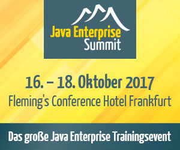

layout: true
.logo[]
.copyright[&copy; 2016 Java User Group Darmstadt]
---
class: center, middle

# Aktuelle Informationen
.slideshow[<input id="autoSlideshow" type="checkbox" title="Auto Slideshow" />]

---
background-color: #ff0000;

## Nächste Events (1) 

### **28.06.2016**: .red[An Evening of OSGi] (OSGi Expert Groups)
### **14.07.2016**: API-Design (Kai Spichale)
### **04.08.2016**: .red[Glue for the Internet of Things] (Jens Deters)
### **08.09.2016**: UI in Microservices (Stefan Tilkov)
### **13.10.2016**: .red[Versionshistorie Softwareprojekte] (Dennis Pagano)

.footnote[Von der TU Darmstadt abweichende Veranstaltungsorte sind .red[rot] markiert.]

---
background-color: #ff0000;

## Nächste Events (2)

### **17.11.2016**: .red["Multi-Channel"-Architektur] (Lars Röwekamp)
### **08.12.2016**: noch offen (Adam Bien)
### **23.02.2017**: JDK 9 / Project Jigsaw (Wolfgang Weigend)

.footnote[Von der TU Darmstadt abweichende Veranstaltungsorte sind .red[rot] markiert.]

---

## An Evening of OSGi

### 6 Mitglieder von OSGi-Expertengruppen (Peter Kriens, ...)
### 4 Vorträge a 20 Minuten
### .red[Dienstag, 28.06.2016 um 18:30 Uhr]
### .red[Deutsche Telekom, T-Online-Allee 1, Darmstadt]
### [Anmeldung auf jug-da.de!!!](http://jug-da.de/2016/06/OSGi-special/)

---

background-image: url(img/plakat.png)

## Plakat

.stripe[Bitte ausdrucken und aufhängen!]
.stripe[neu: http://jug-da.de/plakat]

---

## Unsere wichtigsten Kanäle

&nbsp;
### **Twitter**: [@JUG_DA](https://twitter.com/jug_da)

### **Blog** (Ankündigungen): http://jug-da.de

### **Mailingliste**: https://groups.google.com/d/forum/jug-da

---

## Wechselnde Veranstaltungsorte

&nbsp;  
&nbsp;  
Wir suchen interessierte Firmen:

- Raumanforderung: .strong[30+]

- Zeitraum: abends ab .strong[18:30 Uhr]

- Lage: .strong[Darmstadt (Zentrumsnähe)]

- Kontakt: info@jug-da.de

---

## Java Enterprise Summit und Microservices Summit

http://www.javaenterprisesummit.de 

http://www.microservices-summit.de

### 15 % Rabattcode (Mail an orga@jug-da.de)

---

## Vielen Dank an unsere Sponsoren

---

## Verlosung

<label for="showAttendees">Zeige Teilnehmer <input id="showAttendees" type="checkbox" title="Zeige Teilnehmer" /></label>

<textarea id="attendees" style="display:none;" rows="10" cols="40" onClick="resizeLotteryInput(false);" onBlur="resizeLotteryInput(true);">
Gerd
Jan
Jörn
Marcel
Niko
Sebastian
Falk</textarea>

 

    <button onClick="nextWinner()">Nächster Gewinner</button>
    <button onClick="resetLottery()">Reset</button>

???

Namen aus der Teilnehmerliste in das Textarea kopieren.

---

## Viel Spaß beim Vortrag

&nbsp;
### Nach dem Vortrag ist vor dem Stammtisch

Heute bleiben wir einfach hier. Vielen Dank an die [Gesellschaft für Informatik - Regionalgruppe Rhein-Main](http://rg-rhein-main.gi.de/).  

.center[]  
