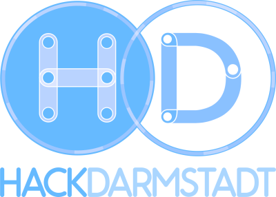
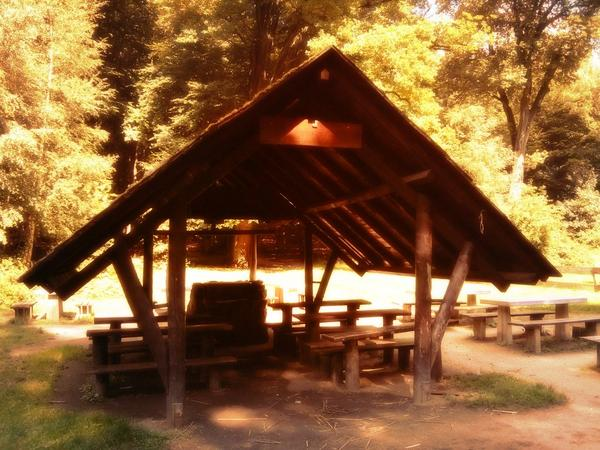

class: center, middle

# Aktuelle Informationen
.slideshow[<input id="autoSlideshow" type="checkbox" title="Auto Slideshow" />]

---
layout: true
.logo[]
.copyright[&copy; 2017 [Java User Group Darmstadt](http://jug-da.de/2017/01/)]
---
background-color: #ff0000;

## <i class="fa fa-calendar"></i> Nächste Events

<table>
	<tr>
		<td>**08.06.2017**</td>
		<td><i class="fa fa-university fa-container"><i class="fa fa-ban fa-nested"></i></i></td>
		<td>10 Jahre DDD (Carola Lilienthal + Henning Schwentner)</td>
		<td>[<i class="fa fa-external-link"></i>](http://jug-da.de/2017/06/10-Jahre-DDD/)</td>
	</tr>
	<tr>
		<td>**09./10.06.2017**</td>
		<td><i class="fa fa-university fa-container"><i class="fa fa-ban fa-nested"></i></i></td>
		<td>Hack Darmstadt</td>
		<td>[<i class="fa fa-external-link"></i>](http://jug-da.de/2017/06/HackDarmstadt/)</td>
	</tr>
	<tr>
		<td>**14.06.2017**</td>
		<td><i class="fa fa-university fa-container"><i class="fa fa-ban fa-nested"></i></i></td>
		<td>JUG Barbecue an der Oberförsterwiese</td>
		<td>[<i class="fa fa-external-link"></i>](http://jug-da.de/2017/06/Vierter-Barbecue-Stammtisch/)</td>
	</tr>
	<tr>
		<td>**13.07.2017**</td>
		<td><i class="fa fa-university"></i></td>
		<td>Software Teams Debuggen (Elmar Jürgens)</td>
		<td>[<i class="fa fa-external-link"></i>](http://jug-da.de/2017/07/Software-Teams-Debuggen/)</td>
	</tr>
</table>
&nbsp;

.footnote[Von der TU Darmstadt abweichende Veranstaltungsorte sind markiert.]

---

## <i class="fa fa-calendar"></i> Nächste Events

<table>
	<tr>
		<td>**24.08.2017**</td>
		<td><i class="fa fa-university"></i></td>
		<td>Vavr und Resilience4j (Robert Winkler)</td>
		<td>[<i class="fa fa-external-link"></i>](http://jug-da.de/2017/08/Vavr-Resilience4j/)</td>
	</tr>
	<tr>
		<td>**21.09.2017**</td>
		<td><i class="fa fa-university fa-container"><i class="fa fa-ban fa-nested"></i></i></td>
		<td>Everything as Code (Mario-Leander Reimer)</td>
		<td>[<i class="fa fa-external-link"></i>](http://jug-da.de/2017/09/Everything-as-Code/)</td>
	</tr>
	<tr>
		<td>**19.10.2017**</td>
		<td><i class="fa fa-university"></i></td>
		<td>Spring Boot Starters (Michael Simons)</td>
		<td>[<i class="fa fa-external-link"></i>](http://jug-da.de/2017/10/Spring-Boot-Starters/)</td>
	</tr>
</table>
&nbsp;

.footnote[Von der TU Darmstadt abweichende Veranstaltungsorte sind markiert.]

---

## <i class="fa fa-bullhorn"></i> Unsere wichtigsten Kanäle

&nbsp;
### **Twitter**: [@JUG_DA](https://twitter.com/jug_da)

### **Blog** (Ankündigungen): http://jug-da.de

### **Mailingliste**: https://groups.google.com/d/forum/jug-da

---

background-image: url(img/plakat.png)

## <i class="fa fa-list-alt"></i> Plakat

.stripe[http://jug-da.de/plakat]
--
.stripe[Bitte ausdrucken und aufhängen!]
--
.stripe[Gern Bild twittern an @JUG_DA]

---

## <i class="fa fa-building-o"></i> Wechselnde Orte

&nbsp;
&nbsp;
Wir suchen interessierte Firmen:

- Raumanforderung: .strong[30+]

- Zeitraum: abends ab .strong[18:30 Uhr]

- Lage: .strong[Darmstadt (Zentrumsnähe)]

- Kontakt: info@jug-da.de

---

## Hackathon am 09./10.06.2017
 
.center[]

&nbsp;
&nbsp;
 
Civic Tech und LoRaWAN Hackathon für ein besseres Darmstadt, veranstaltet von JUG Darmstadt, IoT Hessen, BSI und anderen.

---

## 4. Darmstädter JUG Barbecue Stammtisch am 14.06.2017
 
.center[]
 
Wir besorgen den Grillplatz, Getränke, Brot, Salate usw.
 
Ihr bringt mit, was Ihr auf den Grill legen wollt.

Vielen Dank an unseren Sponsor 

---
   
## API Summit und Microservices Summit
 

 
http://www.api-summit.de
  

http://www.microservices-summit.de
 
### 15 % Rabattcode (Mail an orga@jug-da.de)

---

## <i class="fa fa-building-o"></i> Vielen Dank

---

## <i class="fa fa-users"></i> Verlosung

<label for="showAttendees">Zeige Teilnehmer <input id="showAttendees" type="checkbox" title="Zeige Teilnehmer" /></label>

<textarea id="attendees" style="display:none;" rows="10" cols="40" onClick="resizeLotteryInput(false);" onBlur="resizeLotteryInput(true);">
Gerd
Jan
Jörn
Marcel
Niko
Sebastian
Falk</textarea>

    <button onClick="nextWinner()">Nächster Gewinner</button>
    <button onClick="resetLottery()">Reset</button>

<h2 id="winner" style="color:red"></h2>

???

Namen aus der Teilnehmerliste in das Textarea kopieren.

---

## Viel Spaß beim Vortrag

&nbsp;

### Nach dem Vortrag bleiben wir einfach hier. Vielen Dank an IT for Work.

.center[]
