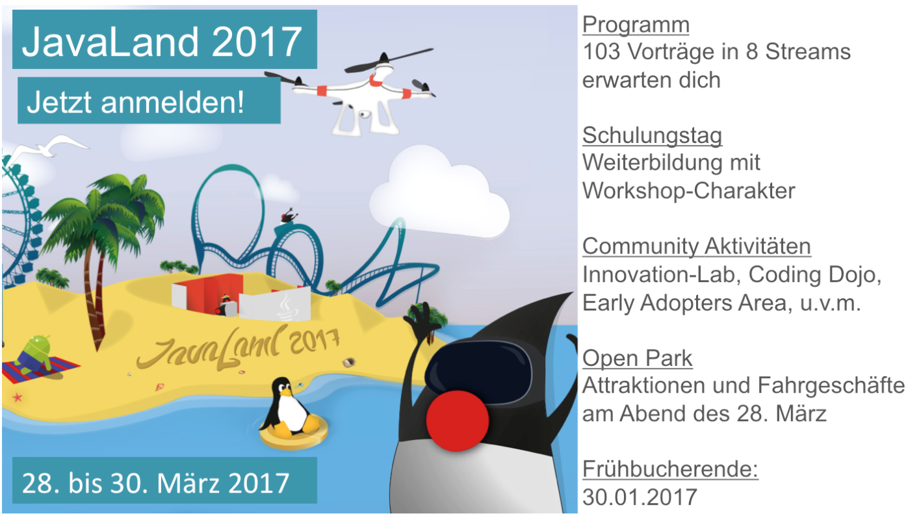

class: center, middle

# Aktuelle Informationen
.slideshow[<input id="autoSlideshow" type="checkbox" title="Auto Slideshow" />]

---
layout: true
.logo[]
.copyright[&copy; 2017 [Java User Group Darmstadt](http://jug-da.de/2017/01/)]
---
background-color: #ff0000;

## Nächste Events <i class="fa fa-calendar"></i>

<table>
	<tr>
		<td>**26.01.2017**</td>
		<td><i class="fa fa-university fa-container"><i class="fa fa-ban fa-nested"></i></i></td>
		<td>Fork/Join ManagedBlocker (Heinz Kabutz)</td>
		<td>[<i class="fa fa-external-link"></i>](http://jug-da.de/2017/01/Fork-Join-ManagedBlocker/)</td>
	</tr>
	<tr>
		<td>**23.02.2017**</td>
		<td><i class="fa fa-university"></i></td>
		<td>JDK 9 / Project Jigsaw (Wolfgang Weigend)</td>
		<td>[<i class="fa fa-external-link"></i>](http://jug-da.de/2017/02/Java-9-Jigsaw/)</td>
	</tr>
	<tr>
		<td>**16.03.2017**</td>
		<td><i class="fa fa-university fa-container"><i class="fa fa-ban fa-nested"></i></i></td>
		<td>Softwarearchitektur für alle (Stefan Zörner)</td>
		<td>[<i class="fa fa-external-link"></i>](http://jug-da.de/2017/03/Softwarearchitektur-fuer-alle/)</td>
	</tr>
	<tr>
		<td>**20.04.2017**</td>
		<td><i class="fa fa-university fa-container"><i class="fa fa-ban fa-nested"></i></i></td>
		<td>openHAB 2 (Kai Kreuzer)</td>
		<td>[<i class="fa fa-external-link"></i>](http://jug-da.de/2017/04/openHAB-2/)</td>
	</tr>
	<tr>
		<td>**11.05.2017**</td>
		<td><i class="fa fa-university fa-container"><i class="fa fa-ban fa-nested"></i></i></td>
		<td>IntelliJ IDEA Trickkiste (Yann Cébron)</td>
		<td>[<i class="fa fa-external-link"></i>](http://jug-da.de/2017/05/IntelliJ-Tricks/)</td>
	</tr>
</table>
&nbsp;

.footnote[Von der TU Darmstadt abweichende Veranstaltungsorte sind markiert.]

---

## Nächste Events (2) <i class="fa fa-calendar"></i>

<table>
	<tr>
		<td>**08.06.2017**</td>
		<td><i class="fa fa-university fa-container"><i class="fa fa-ban fa-nested"></i></i></td>
		<td>10 Jahre DDD (Carola Lilienthal + Henning Schwentner)</td>
		<td>[<i class="fa fa-external-link"></i>](http://jug-da.de/2017/06/10-Jahre-DDD/)</td>
	</tr>
	<tr>
		<td>**29.06.2017**</td>
		<td><i class="fa fa-university fa-container"><i class="fa fa-ban fa-nested"></i></i></td>
		<td>JUG Barbecue an der Oberförsterwiese</td>
		<td></td>
	</tr>
	<tr>
		<td>**13.07.2017**</td>
		<td><i class="fa fa-university"></i></td>
		<td>Software Teams Debuggen (Elmar Jürgens)</td>
		<td>[<i class="fa fa-external-link"></i>](http://jug-da.de/2017/07/Software-Teams-Debuggen/)</td>
	</tr>
</table>
&nbsp;

.footnote[Von der TU Darmstadt abweichende Veranstaltungsorte sind markiert.]

---

## Unsere wichtigsten Kanäle <i class="fa fa-bullhorn"></i>

&nbsp;
### **Twitter**: [@JUG_DA](https://twitter.com/jug_da)

### **Blog** (Ankündigungen): http://jug-da.de

### **Mailingliste**: https://groups.google.com/d/forum/jug-da

---

background-image: url(img/plakat.png)

## Plakat <i class="fa fa-list-alt"></i>

.stripe[http://jug-da.de/plakat]
--
.stripe[Bitte ausdrucken und aufhängen!]
--
.stripe[Gern Bild twittern an @JUG_DA]

---

## Wechselnde Orte <i class="fa fa-building-o"></i>

&nbsp;
&nbsp;
Wir suchen interessierte Firmen:

- Raumanforderung: .strong[30+]

- Zeitraum: abends ab .strong[18:30 Uhr]

- Lage: .strong[Darmstadt (Zentrumsnähe)]

- Kontakt: info@jug-da.de

---

## Entwicklertag Frankfurt 2017

&nbsp;
- 16./17.02.2017, Universität Frankfurt - Campus Westend

- https://entwicklertag.de/frankfurt/2017

---

http://www.javaland.eu/

---

## Vielen Dank <i class="fa fa-building-o"></i>

---

## Verlosung <i class="fa fa-users"></i>

<label for="showAttendees">Zeige Teilnehmer <input id="showAttendees" type="checkbox" title="Zeige Teilnehmer" /></label>

<textarea id="attendees" style="display:none;" rows="10" cols="40" onClick="resizeLotteryInput(false);" onBlur="resizeLotteryInput(true);">
Gerd
Jan
Jörn
Marcel
Niko
Sebastian
Falk</textarea>

    <button onClick="nextWinner()">Nächster Gewinner</button>
    <button onClick="resetLottery()">Reset</button>

<h2 id="winner" style="color:red"></h2>

???

Namen aus der Teilnehmerliste in das Textarea kopieren.

---

## Viel Spaß beim Vortrag

&nbsp;

### Nach dem Vortrag ist vor dem Stammtisch

