class: center, middle

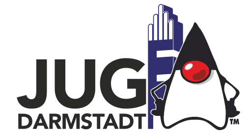

# Aktuelle Informationen

.slideshow[<input id="autoSlideshow" type="checkbox" title="Auto Slideshow" /> Slideshow]
.copyright[[jug-da.de/slides](https://www.jug-da.de/slides) | &copy; 2025 [Java User Group Darmstadt](http://jug-da.de/) (Veranstaltung des [iJUG e.V.](https://www.ijug.eu/))]

---
layout: true
.logo[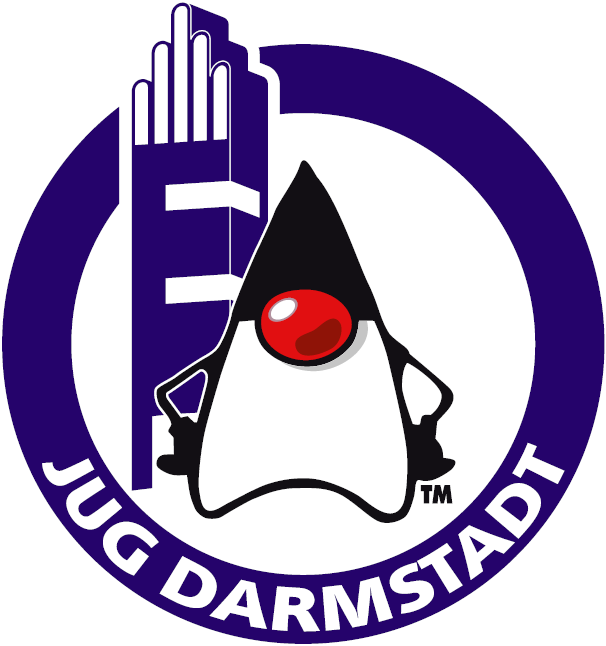]
.copyright[[jug-da.de/slides](https://www.jug-da.de/slides) | &copy; 2025 [Java User Group Darmstadt](http://jug-da.de/) (Veranstaltung des [iJUG e.V.](https://www.ijug.eu/))]

???

background-image: url(img/jha-rip.jpg)

---

background-color: #ff0000;

## <i class="fa fa-calendar"></i> Nächste Events

&nbsp;

  |  |  | 
------------- |------------- |------------- | -------------
**11.12.2025** | <i class="fa fa-building"></i> | 30 Jahre Java (Adam Bien) | [<i class="fa fa-external-link"></i>](https://www.jug-da.de/) |
**22.01.2026** | <i class="fa fa-building"></i> | Domain Rediscovery Patterns für Legacy Code (Richard Gross) | [<i class="fa fa-external-link"></i>](https://www.jug-da.de/) |
**19.02.2026** | <i class="fa fa-building"></i> | Newcomer-Event (Alex Eimer + Fedor Zholud + Christoph Gerlach) | [<i class="fa fa-external-link"></i>](https://www.jug-da.de/) |

.footnote[Veranstaltungsort: <i class="fa fa-globe"></i> Online / <i class="fa fa-university"></i> TU Darmstadt / <i class="fa fa-building"></i> Sponsor]

???

background-color: #ff0000;

## <i class="fa fa-calendar"></i> Nächste Events (2)

&nbsp;

  |  |  | 
------------- |------------- |------------- | -------------
**18.11.2021** | <i class="fa fa-globe"></i> | Eventually Consistency (**.darkblue[Susanne Braun]**) | [<i class="fa fa-external-link"></i>](https://www.jug-da.de/) |
**09.12.2021** | <i class="fa fa-globe"></i> | DDD mit jMolecules (**.darkblue[Oliver Drotbohm & Henning Schwentner]**) | [<i class="fa fa-external-link"></i>](https://www.jug-da.de/2021/06/Hibernate/) |

.footnote[Veranstaltungsort: <i class="fa fa-globe"></i> Online / <i class="fa fa-university"></i> TU Darmstadt / <i class="fa fa-building"></i> Sponsor]

???

## <i class="fa fa-bullhorn"></i> Remote oder Vor-Ort

.stripe[Im Moment planen wir hauptsächlich Vor-Ort.]
.stripe[Wir versuchen aber auch parallel, Remote-Zuschauer einzubinden (Hybrid).]

???

background-image: url(img/gdcr2024.jpg)

---

background-image: url(img/zugunkonf.jpg)

.bottom[Unsere JUG Community auf dem Weg zum Vortrag]  

---

background-image: url(img/jug-hilfe.jpg)

## <i class="fa fa-bullhorn"></i> Unterstützung

.stripe[<i class="fa fa-bullhorn" aria-hidden="true"></i> Weitersagen - [<i class="fa fa-print" aria-hidden="true"></i> Plakat aufhängen](http://jug-da.de/plakat)]  
.stripe[<i class="fa fa-globe" aria-hidden="true"></i> http://jug-da.de] 
.stripe[<i class="fa fa-twitter" aria-hidden="true"></i> [@JUG_DA](https://twitter.com/jug_da) - [<i class="fa fa-envelope-o" aria-hidden="true"></i>](https://groups.google.com/d/forum/jug-da) - [<i class="fa fa-rss-square" aria-hidden="true"></i>](https://www.jug-da.de/feed.xml) - [<i class="fa fa-calendar" aria-hidden="true"></i>](https://www.jug-da.de/events.ics)]

???

CC0 Creative Commons: https://pixabay.com/de/frau-posen-e-learning-weiblich-1401616/

Bitte ausdrucken und aufhängen: http://jug-da.de/plakat
Gern Bild twittern an @JUG_DA.

---

background-image: url(img/jug-welcome.jpg)

## <i class="fa fa-list-alt"></i> Sponsoring

.stripe[Gastgeber]  
.stripe[Catering]  
.stripe[Merchandising] 

???

CC0 Creative Commons: https://pixabay.com/de/frau-posen-e-learning-weiblich-1447068/

Wir suchen interessierte Firmen:
- Raumanforderung: .strong[30+]
- Zeitraum: abends ab .strong[18:30 Uhr]
- Lage: .strong[Darmstadt (Zentrumsnähe)]
- Kontakt: info@jug-da.de
- Übernahme von Catering
- Kaufen von Merchandise-Artikeln (T-Shirts, Tassen, ...)

???

background-image: url(img/grillplatz.jpg)

.stripe[<i class="fa fa-bullhorn" aria-hidden="true"></i> 10. JUG Darmstadt Barbecue]
.stripe[<i class="fa fa-calendar" aria-hidden="true"></i> 30.09.2025]

---

## <i class="fa fa-bullhorn"></i> Weitere Veranstaltungen

.beam[[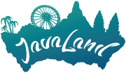](https://www.javaland.eu/de/home/) &nbsp;10. - 12.03.2026]
.beam[[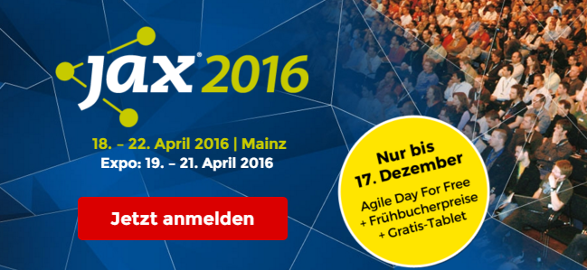](https://jax.de/) &nbsp;04. - 08.05.2025 (15 % Rabatt)]

### Rabattcodes über orga@jug-da.de

???

.beam[ &nbsp;04. - 08.11.2024 (15 % Rabatt)]

---

background-image: url(img/jug-newcomer.jpg)

## <i class="fa fa-search"></i> Newcomer werden

- Vortrag auf einer (großen) Konferenz halten?

- Wir unterstützen Euch: 
  - Thema
  - Titel, Abstract
  - Einreichung
  - Folien
  - Generalprobe bei der JUG
  - Tipps und Tricks zum Vortragsstil

- <i class="fa fa-female"></i> + <i class="fa fa-male"></i>

- **Traut Euch. Meldet Euch. Sprecht uns an.**

???

CC0 Creative Commons: https://pixabay.com/de/frau-posen-e-learning-weiblich-1447092/

- z. B. nächste JavaLand, aber auch gern andere, lokale Konferenzen
- bei der JavaLand entweder klassisch über den normalen CfP oder über das Newcomer-Programm

---

background-image: url(img/cyberland_code_camp.png)

.bottom[16.12.2026 - <i class="fa fa-external-link"></i> https://cyberland.ijug.eu/]

???

background-image: url(img/developeronstage.jpg)

## <i class="fa fa-microphone"></i> Tech2Talk

.bottom[Je 4 einstündige Online-Coachings im Juni und November <i class="fa fa-external-link"></i> https://tech2talk.de/]

???

background-image: url(img/speakonf.jpg)

.bottom[Unkonferenz zu Public Speaking in der Tech-Branche. <i class="fa fa-external-link"></i> https://speakonf.de/]

---

background-image: url(img/softwerkskammer.png)

.stripe[z. B. Global Day of Code Retreat]
.stripe[[softwerkskammer.de/groups/rheinmain](https://softwerkskammer.de/groups/rheinmain)]

???

## <i class="fa fa-microphone"></i> Ladies Night Newcomer

### <i class="fa fa-calendar"></i> 02.11.2023 

### <i class="fa fa-universal-access"></i> Diverse und Herren sind natürlich auch willkommen

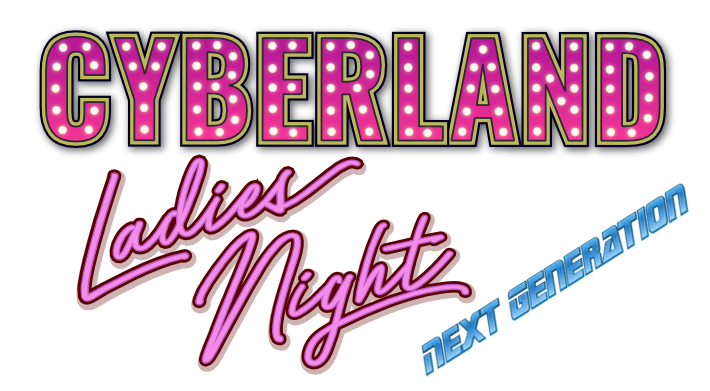

.bottom[<i class="fa fa-external-link"></i> https://cyberland.ijug.eu/2023-11-ladies-night/]

???

## <i class="fa fa-microphone"></i> JSail Unkonferenz

### <i class="fa fa-calendar"></i> 23.06. bis 27.06.2025 

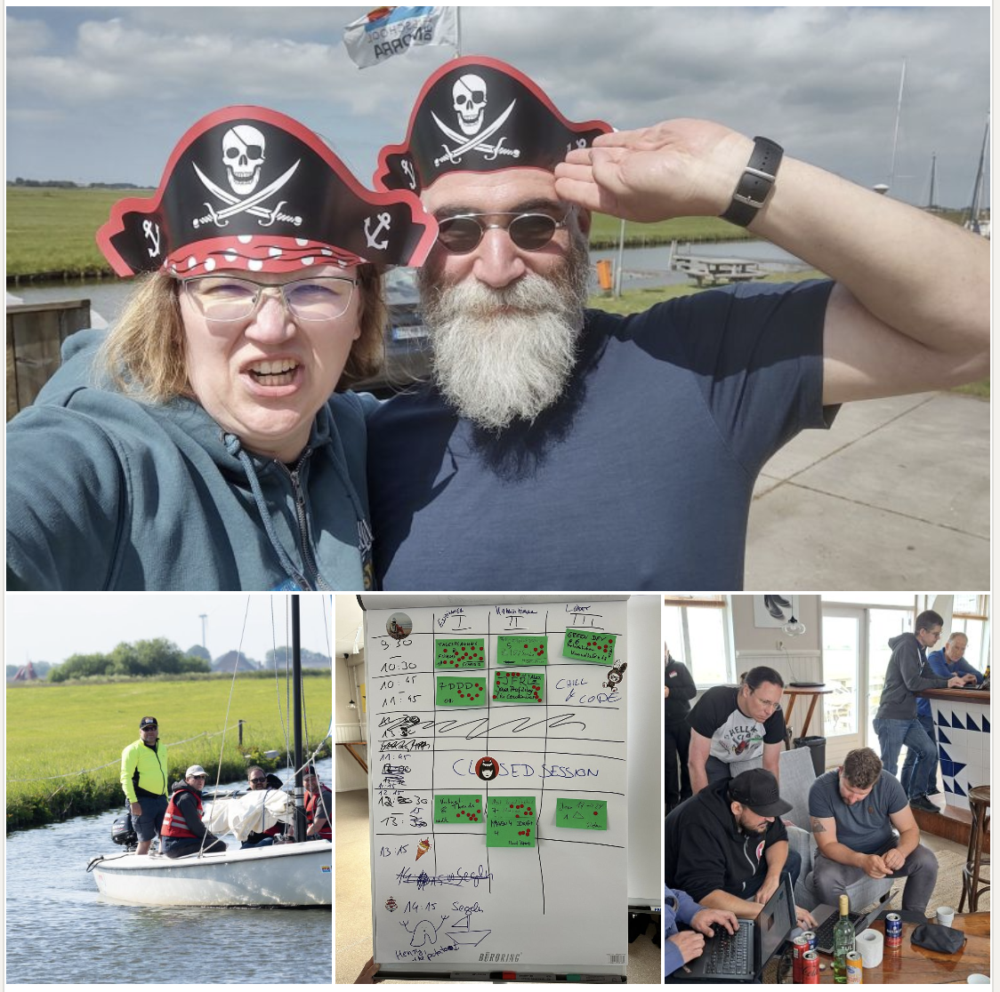

.bottom[<i class="fa fa-external-link"></i> https://jsail.ijug.eu/]

???

## <i class="fa fa-bullhorn"></i> JUG Darmstadt 4 Kids

- Planungen für 2. Termin laufen (Samstag in Q2/2024)

- Darmstädter Kinder und Jugendliche als Teilnehmer
  - 7 - 10 (Grundschulalter)
  - 11 - 14 (Weiterführende Schule)

- Veranstaltungsort: cosee

- Wer mag als Mentor helfen?

- Anmeldung/Fragen an falk@jug-da.de

---

## <i class="fa fa-bullhorn"></i> Buchrezensionen

&nbsp;

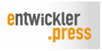

&nbsp;

### <i class="fa fa-envelope-o"></i> [orga@jug-da.de](orga@jug-da.de)

---

## <i class="fa fa-building-o"></i> Vielen Dank

&nbsp;

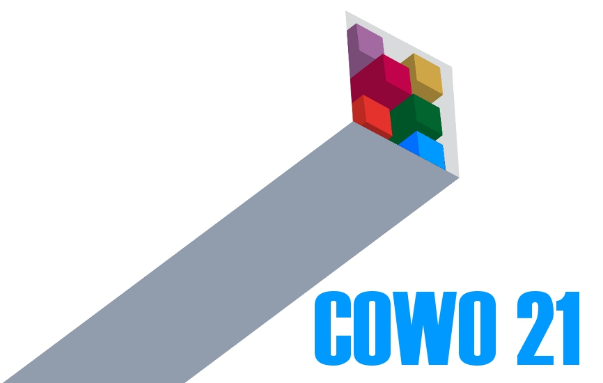

---

## <i class="fa fa-gift"></i> Verlosung

<input id="showAttendees" type="checkbox" title="Zeige Teilnehmer" />
<label for="showAttendees">Zeige Teilnehmer</label>

<textarea id="attendees" style="display:none;" rows="10" cols="40" onClick="resizeLotteryInput(false);" onBlur="resizeLotteryInput(true);">
Melanie
Gerd
Jan
Niko
Sebastian
Falk</textarea>

    <button onClick="nextWinner()">Nächster Gewinner</button>
    <button onClick="resetLottery()">Reset</button>

<h1 id="winner" style="color:red; text-align:center;"></h1>

### Preise

2x Lizenz für ein Jetbrains Tool  
2x Buch Eurer Wahl vom Hanser Verlag  

 
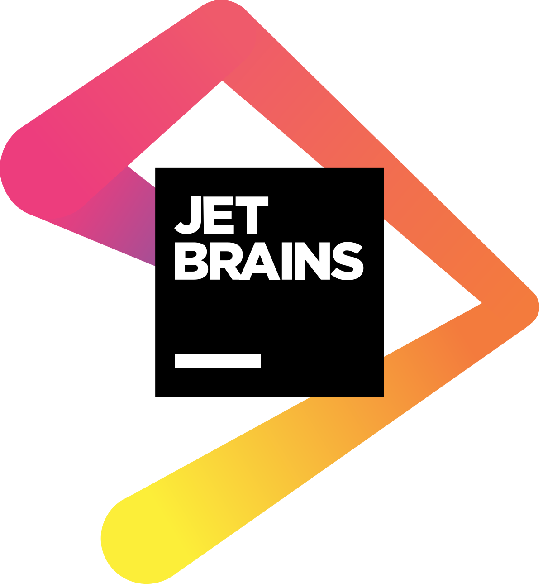 

???

Lizenz für ein Jetbrains Tool 
Jahresabo sigs.de (Java Spektrum, ...)   
Freiticket JAX
- 1 Freiticket zur Verlosung für die Hauptkonferenz (W-JAX)
- 1 Freiticket zur Verlosung für den entwickler Summit
- 1 Fullstack-Mitgliedschaft zur Verlosung
- 15% Rabattcode
Freiticket Sommer OOP 
1 CyberLandConf T-Shirt  
1 Buch Eurer Wahl vom dpunkt Verlag  

 
 
 
 
1 Jetbrains Lizenz (IntelliJ, ...)  

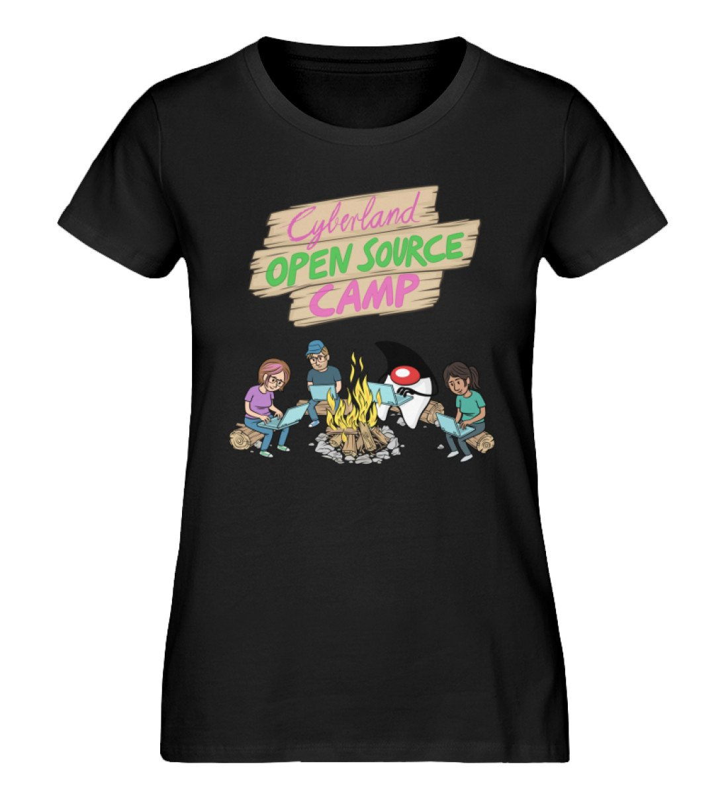 

Namen aus der Teilnehmerliste in das Textarea kopieren.

???

## Feedback zu den Vorträgen

- Was hat Euch heute gut gefallen, wo habt ihr was Interessantes gelernt. 

- Was hat Euch gefehlt oder welche Ideen habt Ihr, was unsere Newcomer für den großen Auftritt auf der JavaLand noch besser machen können?

- Schnappt Euch Post-Its und haltet Euer Feedback fest. 
  
- Oder sprecht Sebastian und Mechti direkt an.

- Vielen Dank.

???

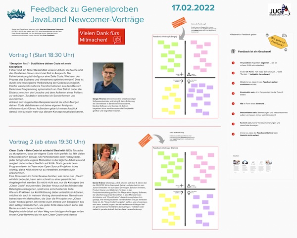

https://tinyurl.com/jugda-feedback

---

## Viel Spaß beim Vortrag

### Nach dem Vortrag bleiben wir einfach hier. 

Vielen Dank an die h_da.

.center[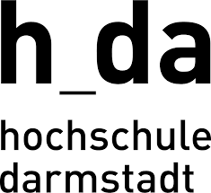]

???

## Viel Spaß beim Vortrag

### Nach dem Vortrag bleiben wir einfach hier. Vielen Dank an Andrena.

.center[]

### Im Anschluss sind wir noch hier und freuen uns, wenn ihr auch beim Remote-Stammtisch dabei seid.

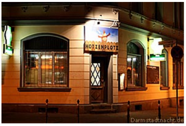

### Nach dem Vortrag ist vor dem Stammtisch

### Nach dem Vortrag bleiben wir einfach hier. Vielen Dank an die Prostep.

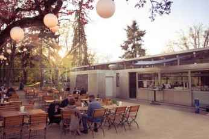
.center[]
