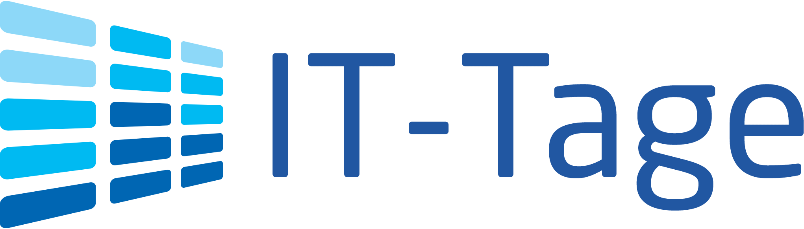

class: center, middle

# Aktuelle Informationen
.slideshow[<input id="autoSlideshow" type="checkbox" title="Auto Slideshow" /> Slideshow]

---
layout: true
.logo[]
.copyright[&copy; 2017 [Java User Group Darmstadt](http://jug-da.de/2017/01/)]

---
background-color: #ff0000;

## <i class="fa fa-calendar"></i> Nächste Events

&nbsp;

<table>
	<tr>
		<td>**07.12.2017**</td>
		<td><i class="fa fa-university"></i></td>
		<td>2. Kunterbunter Abend (Diverse Sprecher)</td>
		<td>[<i class="fa fa-external-link"></i>](https://www.jug-da.de/2017/12/Zweiter-Kunterbunter-Abend/)</td>
	</tr>
	<tr>
		<td>**18.01.2018**</td>
        <td><i class="fa fa-university fa-container"><i class="fa fa-ban fa-nested"></i></i></td>
		<td>REST und Alternativen (Thomas Bayer)</td>
		<td>[<i class="fa fa-external-link"></i>](https://www.jug-da.de/2018/01/REST-GraphQL-gRPC/)</td>
	</tr>
	<tr>
		<td>**22.02.2018**</td>
		<td><i class="fa fa-university"></i></td>
		<td>Kotlin (Benjamin Schmid)</td>
		<td>[<i class="fa fa-external-link"></i>](https://www.jug-da.de/2018/02/Kotlin/)</td>
	</tr>
	<tr>
		<td>**22.03.2018**</td>
		<td><i class="fa fa-university"></i></td>
		<td>Scheitern von Microservices (David Schmitz)</td>
		<td>[<i class="fa fa-external-link"></i>](https://www.jug-da.de/2018/03/10-Tipps-Microservices-scheitern/)</td>
	</tr>
</table>
&nbsp;

.footnote[Von der TU Darmstadt abweichende Veranstaltungsorte sind markiert.]

---
background-color: #ff0000;

## <i class="fa fa-calendar"></i> Nächste Events

<table>
	<tr>
		<td>**19.04.2018**</td>
		<td><i class="fa fa-university"></i></td>
		<td>inspectIT (C. Heger + M. Mann)</td>
		<td>[<i class="fa fa-external-link"></i>](https://www.jug-da.de/2018/04/Open-Source-APM-inspectit/)</td>
	</tr>
	<tr>
		<td>**17.05.2018**</td>
		<td><i class="fa fa-university"></i></td>
		<td>Time is an Illusion (Andreas Heigl)</td>
		<td>[<i class="fa fa-external-link"></i>](https://www.jug-da.de/)</td>
	</tr>
	<tr>
		<td>**16.08.2018**</td>
		<td><i class="fa fa-university"></i></td>
		<td>Aber ich will einfach nur coden (Cosima Laube)</td>
		<td>[<i class="fa fa-external-link"></i>](https://www.jug-da.de/)</td>
	</tr>
	<tr>
		<td>**2018**</td>
		<td><i class="fa fa-university"></i></td>
		<td>Kafka (Matthias Wessendorf)</td>
		<td>[<i class="fa fa-external-link"></i>](https://www.jug-da.de/)</td>
	</tr>
</table>
&nbsp;

.footnote[Von der TU Darmstadt abweichende Veranstaltungsorte sind markiert.]

---

## <i class="fa fa-bullhorn"></i> Unsere wichtigsten Kanäle

&nbsp;

### **Twitter**: [@JUG_DA](https://twitter.com/jug_da)

&nbsp;

### **Blog** (Ankündigungen): http://jug-da.de

&nbsp;

### **Mailingliste**: https://groups.google.com/d/forum/jug-da

---

background-image: url(img/plakat.png)

## <i class="fa fa-list-alt"></i> Plakat

.stripe[http://jug-da.de/plakat]
--
.stripe[Bitte ausdrucken und aufhängen!]
--
.stripe[Gern Bild twittern an @JUG_DA]

---

## <i class="fa fa-building-o"></i> Wechselnde Orte

&nbsp;
&nbsp;

Wir suchen interessierte Firmen:

- Raumanforderung: .strong[30+]

- Zeitraum: abends ab .strong[18:30 Uhr]

- Lage: .strong[Darmstadt (Zentrumsnähe)]

- Kontakt: info@jug-da.de

---

## <i class="fa fa-bullhorn"></i> Weitere Konferenzen

&nbsp;

 28. - 29. November in Köln (300 Euro Rabatt)

 11. - 14. Dezember in Frankfurt (20 % Rabatt)

 21. - 22. Februar 2018 in Frankfurt

 13. - 15. März 2018 in Brühl (20 % Rabatt)

&nbsp;

Gleich Verlosung von Tickets, Rabatte: orga@jug-da.de

---

## <i class="fa fa-bullhorn"></i> Partner Software und Support

&nbsp;

 20% Rabatt bei https://tutorials.entwickler.de/

&nbsp;

Rabatt-Codes bitte per Mail erfragen (orga@jug-da.de)

---

## <i class="fa fa-building-o"></i> Vielen Dank

&nbsp;

---

## <i class="fa fa-users"></i> Verlosung

<label for="showAttendees">Zeige Teilnehmer <input id="showAttendees" type="checkbox" title="Zeige Teilnehmer" /></label>

<textarea id="attendees" style="display:none;" rows="10" cols="40" onClick="resizeLotteryInput(false);" onBlur="resizeLotteryInput(true);">
Gerd
Jan
Jörn
Marcel
Niko
Sebastian
Falk</textarea>

    <button onClick="nextWinner()">Nächster Gewinner</button>
    <button onClick="resetLottery()">Reset</button>

<h1 id="winner" style="color:red; text-align:center;"></h1>

???

Namen aus der Teilnehmerliste in das Textarea kopieren.

---

## Viel Spaß beim Vortrag

### Nach dem Vortrag bleiben wir einfach hier. Vielen Dank an Accso.

&nbsp;

.center[]  
